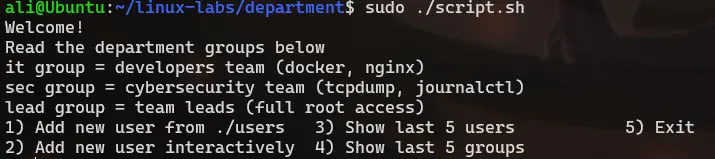
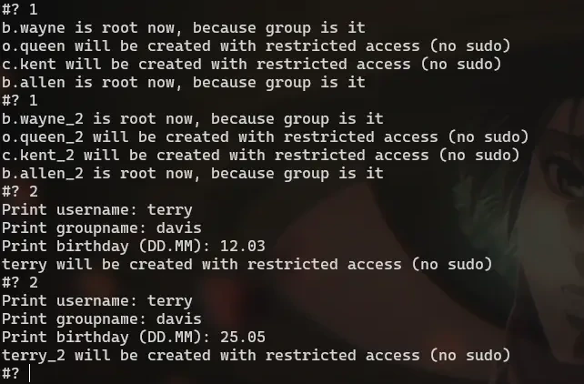
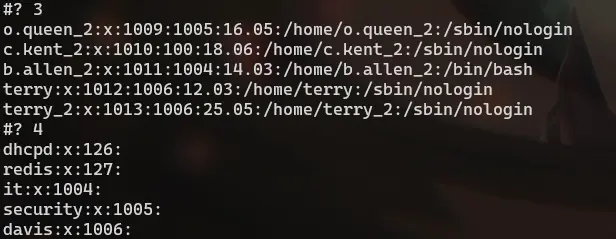

# User Provisioning & Department Access Script

A trainee Bash script to automate local user onboarding and configure department-specific sudo privileges. It includes an interactive CLI menu for manual creation, bulk CSV imports, and quick lookups.

### Features
1. Sudo Rule Management: Automatically injects command-specific privileges into /etc/sudoers based on the department.
2. Username Duplication Safety: If a generated username already exists in /etc/passwd, it appends an incrementing counter (_2, _3, etc.).
3. Basic Safeguards: Enforces root-only execution and backs up the original sudoers configuration to /etc/sudoers.bkp before making changes.

### Department

* IT team
  - Shell: /bin/bash
  - Commands: /usr/bin/docker, /usr/bin/nginx, /usr/bin/systemctl
* Cybersecurity team (sec)
  - Shell: /bin/bash
  - Commands: /usr/bin/tcpdump, /usr/bin/journalctl, /usr/sbin/nft, /usr/sbin/iptables
* Team Leads (lead)
  - Shell: /bin/bash
  - Commands: ALL
* Other Teams
  - Shell: /sbin/nologin
  - Commands: None (Restricted profile)

### ./users File Format
Example "./users" data structure:
ID,First_name,Last_name,Birthday,Group_name
1,Johm,Doe,12.04,it
2,Gabe,Lackman,28.09,sec
3,David,Bombal,01.01,lead

You can see all the photos below and also in ./photos directory

### CLI

### Adding from ./users and interactively

### Show last users/groups 

